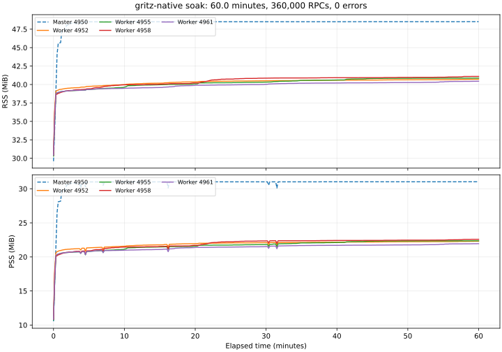

# T2-12: One-hour multiprocess soak

Date: 2026-10-02. The Phase 2 soak gate passed for this workload.

Four workers served 360,000 unary RPCs over 3,600.020 seconds with zero errors.
Every worker received traffic, all worker PIDs stayed unchanged, and graceful shutdown succeeded.
The master and all four workers were confirmed reaped after the run.

## Environment and workload

| Item | Value |
| --- | --- |
| Linux | 6.8.0-117-generic, aarch64 |
| Docker VM | 2 CPUs, 2,053,644,288 bytes of memory |
| Ruby | 3.4.11 |
| grpc / google-protobuf / json | 1.83.0 / 4.36.2 / 2.21.2 |
| tcp_migrate_req | 1 |
| Start | 2026-10-02 05:05:54 UTC |
| Workers / client connections | 4 / 32 |
| Target request rate | 100 unary RPCs per second |
| Sampling interval / RPC timeout | 10 seconds / 5 seconds |
| Mean / maximum RPC latency | 6.510 ms / 38.501 ms |

Clients used independent C-core subchannel pools and disabled retries.
Each response returned its worker PID, so successful requests were attributed to the serving worker.
The workload used the hello fixture, preloaded application code and one-second worker heartbeats.
This is a lifecycle and memory soak, with functional coverage for all four RPC forms supplied by the integration suite.

## Memory and distribution



| Process | Successful RPCs | Final RSS (MiB) | Final PSS (MiB) | RSS change in last 10 minutes (KiB) |
| --- | ---: | ---: | ---: | ---: |
| Master 4950 | — | 48.52 | 31.03 | +4 |
| Worker 4952 | 97,962 | 40.71 | 22.30 | +76 |
| Worker 4955 | 86,476 | 40.87 | 22.37 | +28 |
| Worker 4958 | 100,002 | 41.10 | 22.59 | +132 |
| Worker 4961 | 75,560 | 40.45 | 21.94 | +180 |

Workers retained 26 threads each, and the master retained two.
Memory rose during warmup and then stayed within the recorded range; the last ten minutes added at most 180 KiB of worker RSS.
No leak or hang was observed in this one-hour workload. These measurements do not establish behavior for every application or a longer run.

## Source and validation

The running processes loaded the initial Phase 2 core implementation at
`b0f5449fafe2fc0f37758434e656569005f6e969` and the native fork adapter before the version bump.
While the run continued, startup/shutdown failure exits, the status-record ceiling and inherited signal restoration were corrected.
The normal serving path exercised here was unchanged by those fixes.
Final v0.2.0 source passed 83 core, 48 native Linux and 12 meta examples, lint and strict package builds.
GitHub CI also passed on Ruby 3.3, 3.4 and 4.0 in each repository.

The earlier shared-subchannel run was interrupted and does not count toward this gate.
The benchmark now also has startup, startup-timeout and client-setup failure injections that verify process cleanup.

## Reproduce

Install the development bundle on Linux, then run:

```sh
bundle exec ruby bench/soak.rb --output bench/results/soak.json
python bench/plot_soak.py bench/results/soak.json --output bench/results/soak.svg
bundle exec ruby bench/check_cleanup.rb
```

Matplotlib is a reporting dependency only.
The complete measurements are in [the raw JSON report](../../bench/results/2026-10-02-phase2.json).
